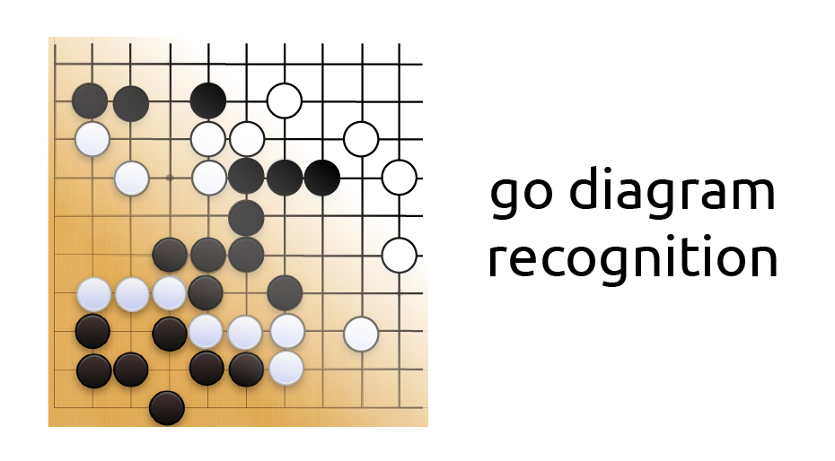

# Распознавание го-диаграмм



Приложение, распознающее го-диаграммы и экспортирующее их в sgf.
## Информация о приложении
* Поддерживаемые форматы: .jpg/.jpeg, .png, .pdf
* Поддерживается работа со сканами го-диаграмм, а также с фотографиями-"сканами", обработанными с помощью специального приложения на телефон.
Чтобы избежать ошибок в распознавании важно, чтобы страница была ровной, и на ней не было теней/посторонних объектов.
* Дополнительный функционал -- возможность слияния нескольких sgf-файлов в один (c несколькими вариантами игры, соответствующими исходным файлам).
* Кроме кнопок в приложении, превью распознанных диаграмм можно переключать клавишами "a" и "d", а также колесом мыши.

## Установка:

Версии можно скачать со [страницы загрузки](docs/releases.md). Для подробностей по сборке см. [deploy](docs/deploy.md).

Также приложение можно установить через pip командой ниже
```bash
pip install .
```
<details>
<summary>Для разработчиков</summary>
Если вы разработчик, его следует установить в editable режиме (желательно в виртуальной среде):

```bash
pip install -e .
```
</details>
